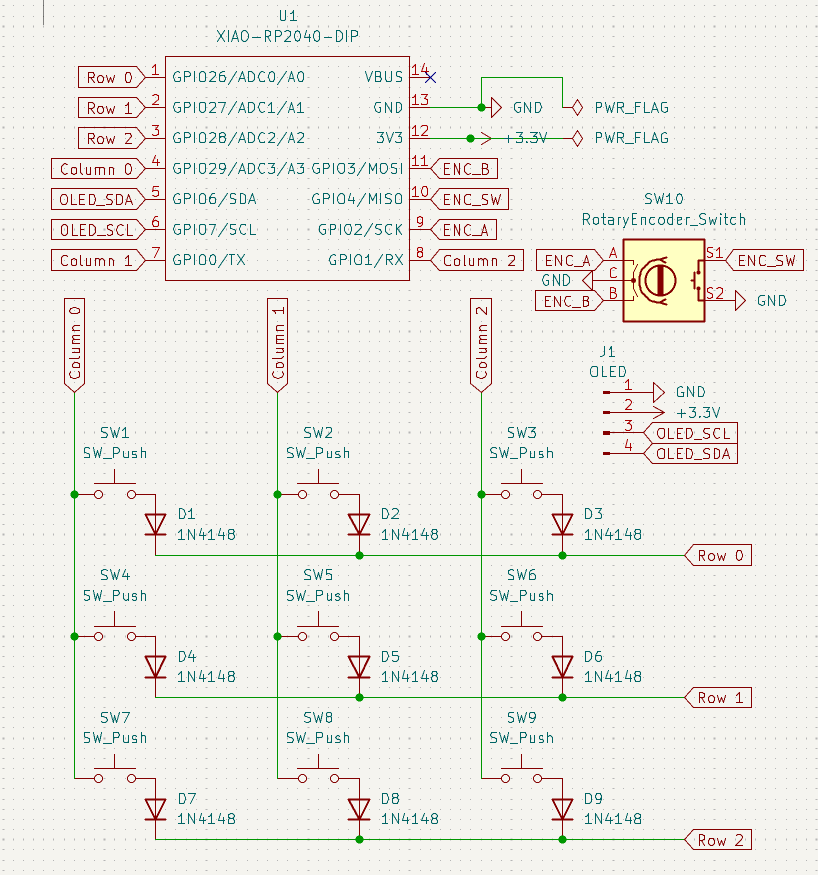
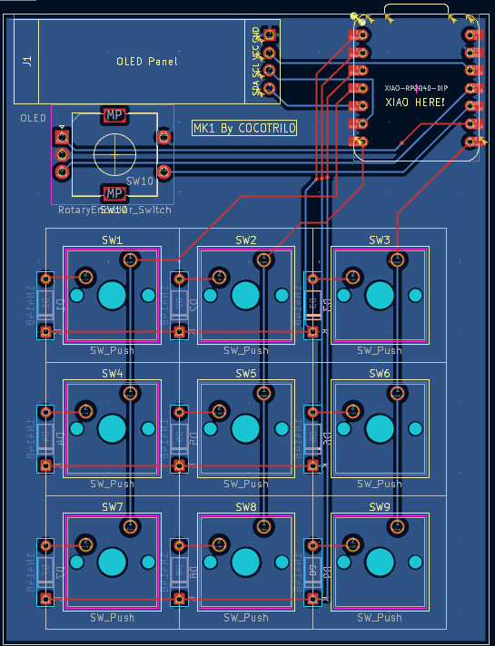
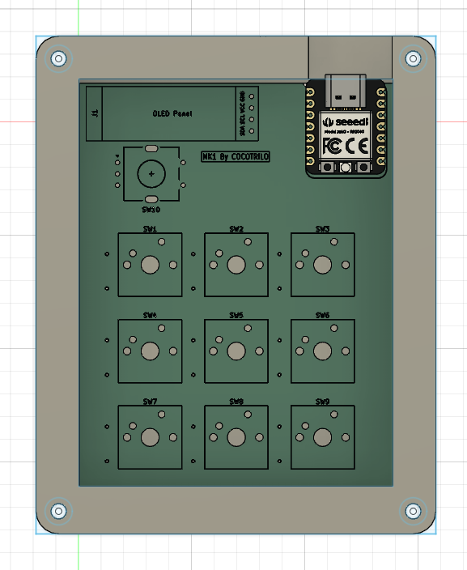

# IsaacMacropad
A highly versatile macropad like a "Swiss-army tool" for my computer workflow usable in many different situations such as video editing, 3d modeling, and general system control The macropad will inclide 3x3 or 2x2 key layout and at least one rotary encoder for precise control. This is my first hardware project, and im really exited about it.

## Project Overview (HackPad)

## Schematic

## PCB Design

## Case Design

## Bom 
| Item | Component | Quantity | Notes |
|-----:|----------|----------|-------|
| 1 | Seeed Studio XIAO RP2040 | 1 | Main microcontroller |
| 2 | Mechanical switches (MX compatible) | 9 | Key switches |
| 3 | Keycaps | 9 | 1u keycaps |
| 4 | EC11 Rotary Encoder | 1 | With push button |
| 5 | OLED Display (128x64 I2C) | 1 | Status display |
| 6 | Diodes 1N4148 | 9 | For key matrix |
| 7 | PCB | 1 | Custom designed |
| 8 | Case | 1 | 3D printed |

##
Thanks for reading if you liked it leave a follow! :)
